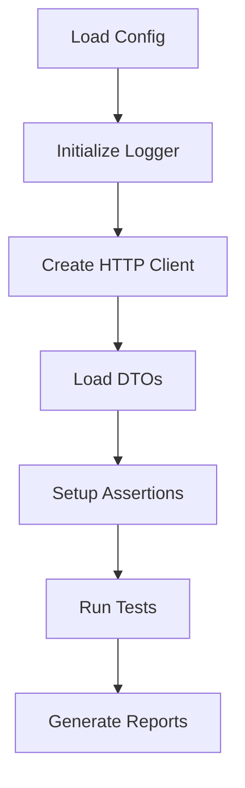

# Modular Test Framework Plan

## Overview
Implement a modular test framework in JavaScript for testing REST APIs using JSONPlaceholder (https://jsonplaceholder.typicode.com). The framework will be config-driven, use DTOs for data modeling, provide fluent assertions, and include logging capabilities.

## Technology Stack
- **Testing Framework**: Jest (for test runner, assertions, and mocking)
- **HTTP Client**: Axios (for making HTTP requests)
- **Assertion Library**: Chai (for fluent assertions)
- **Logger**: Custom ILogger interface with ConsoleLogger implementation
- **Language**: JavaScript (ES6+)

## Architecture Design

### Modular Components
```
test-framework/
├── config/
│   └── config.js          # Base URLs, headers, timeouts
├── dto/
│   ├── PostDTO.js         # Request/Response DTOs
│   ├── CommentDTO.js
│   └── UserDTO.js
├── logger/
│   ├── ILogger.js         # Interface definition
│   └── ConsoleLogger.js   # Implementation
├── http/
│   └── HttpClient.js      # Axios wrapper with config
├── assertions/
│   └── FluentAssertions.js # Chai-based fluent assertions
├── tests/
│   ├── posts.test.js      # Test suites
│   ├── comments.test.js
│   └── negative.test.js
├── data/
│   ├── test-data.json     # Data-driven test data
│   └── negative-cases.json
├── utils/
│   └── test-utils.js      # Helper functions
├── package.json
└── jest.config.js
```

### Component Responsibilities

#### Config Module
- Manages base URLs for different environments
- Handles default headers (Content-Type, Authorization, etc.)
- Configurable timeouts and retry logic

#### DTOs (Data Transfer Objects)
- PostDTO: id, userId, title, body
- CommentDTO: id, postId, name, email, body
- UserDTO: id, name, username, email, address, phone, website, company

#### Logger
- ILogger interface: log(), error(), warn(), info()
- ConsoleLogger: Console-based implementation with timestamps

#### HTTP Client
- Axios wrapper with config injection
- Automatic header setting
- Error handling and logging

#### Assertions
- Fluent API: expect(response).toHaveStatus(200).and.toHaveBody().withProperty('id')
- Chainable assertions for status, body, headers

#### Tests
- Positive tests: 3 per HTTP method (GET, POST, PUT, DELETE)
- Negative tests: Invalid IDs, wrong methods, malformed data
- Data-driven tests: Using external JSON files

## Test Scenarios

### Positive Tests (3 per method)
**GET:**
1. Get all posts
2. Get post by ID
3. Get posts by user ID (query params)

**POST:**
1. Create new post
2. Create post with nested data
3. Create post with custom headers

**PUT:**
1. Update existing post
2. Update partial post data
3. Update with different user ID

**DELETE:**
1. Delete existing post
2. Delete non-existent post (should succeed)
3. Delete with authentication

### Negative Tests (at least 3)
1. GET with invalid ID (404)
2. POST with invalid data structure (400)
3. PUT on non-existent resource (404)
4. DELETE with wrong method (405)

### Data-Driven Tests
- External JSON files containing test data arrays
- Jest.each() for parameterized tests
- Separate data files for different scenarios

## Implementation Flow



## Configuration Example
```javascript
// config/config.js
module.exports = {
  baseUrl: 'https://jsonplaceholder.typicode.com',
  headers: {
    'Content-Type': 'application/json',
    'Accept': 'application/json'
  },
  timeout: 5000
};
```

## DTO Example
```javascript
// dto/PostDTO.js
class PostDTO {
  constructor(id, userId, title, body) {
    this.id = id;
    this.userId = userId;
    this.title = title;
    this.body = body;
  }
}
```

## Fluent Assertions Example
```javascript
// assertions/FluentAssertions.js
class FluentAssertions {
  constructor(actual) {
    this.actual = actual;
  }

  toHaveStatus(expectedStatus) {
    expect(this.actual.status).toBe(expectedStatus);
    return this;
  }

  and() {
    return this;
  }

  toHaveBody() {
    expect(this.actual.data).toBeDefined();
    return this;
  }
}
```

## Test Example
```javascript
// tests/posts.test.js
describe('Posts API', () => {
  test('should get all posts', async () => {
    const response = await httpClient.get('/posts');
    expect(response).toHaveStatus(200).and.toHaveBody();
  });
});
```

## Next Steps
1. Switch to Code mode for implementation
2. Set up project structure and dependencies
3. Implement each module following the design
4. Write and run tests
5. Refactor and optimize as needed